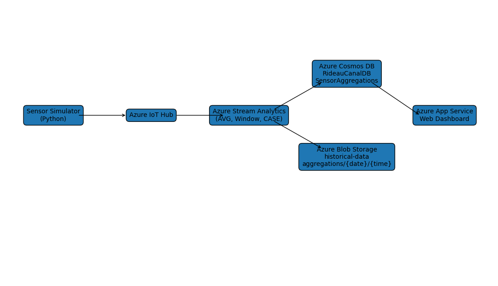

 # Project Repository Links

## Student Information
- **Name:** Vijay Xavier Walter
- **Student ID:** 041276252
- **Course:** CST8916 Winter -Remote Data and RT Applications

## Repository Links

### 1. Main Documentation Repository
- **URL:** https://github.com/vijayxavierwalter/rideau-canal-monitoring.git
- **Description:** Complete project documentation, architecture, screenshots, and guides

### 2. Sensor Simulation Repository
- **URL:** https://github.com/vijayxavierwalter/rideau-canal-sensor-simulation.git
- **Description:** IoT sensor simulator code

### 3. Web Dashboard Repository
- **URL:** https://github.com/vijayxavierwalter/rideau-canal-dashboard.git
- **Description:** Web dashboard application

## Demo

- **Video Demo:** [https://youtu.be/ZoBQyuB1NyE]


# Rideau Canal Real-Time Monitoring System

## Project Description
This project implements a real-time monitoring system for the Rideau Canal using Microsoft Azure services. The system simulates IoT sensors that collect environmental data such as ice thickness and water temperature, processes the data in real time, and displays skating conditions through a web dashboard.

---

## Scenario Overview

### Problem Statement
Monitoring ice conditions manually on the Rideau Canal is inefficient and unsafe. A real-time system is needed to provide accurate and continuous updates on skating conditions.

### System Objectives
- Simulate IoT sensors for multiple locations  
- Process real-time data using Azure Stream Analytics  
- Store data for real-time and historical analysis  
- Display results in an interactive web dashboard  

---

## System Architecture

### Architecture Diagram


### Data Flow
1. Sensor simulator sends telemetry data  
2. Azure IoT Hub receives data  
3. Stream Analytics processes and aggregates data  
4. Data is stored in:
   - Cosmos DB (real-time)
   - Blob Storage (historical)
5. Web dashboard retrieves and displays data  

### Azure Services Used
- Azure IoT Hub  
- Azure Stream Analytics  
- Azure Cosmos DB  
- Azure Blob Storage  
- Azure App Service  

---

## Implementation Overview

### IoT Sensor Simulation
Simulates sensor data for:
- Dow’s Lake  
- Fifth Avenue  
- NAC  

---

### Azure IoT Hub
- Receives telemetry from simulated sensors  
- Device configured: `rideau-canal-sensor-1`rideau-canal-sensor-2, rideau-canal-sensor-3

---

### Stream Analytics Job

```sql
-- Cosmos DB Output
SELECT
    input.location AS location,
    AVG(input.iceThickness) AS avgIceThickness,
    AVG(input.waterTemperature) AS avgWaterTemperature,
    CASE
        WHEN AVG(input.iceThickness) >= 30 THEN 'Excellent'
        WHEN AVG(input.iceThickness) >= 20 THEN 'Good'
        WHEN AVG(input.iceThickness) >= 15 THEN 'Fair'
        ELSE 'Poor'
    END AS skatingCondition,
    System.Timestamp() AS timestamp,
    CONCAT(input.location, '-latest') AS id
INTO cosmosOutput
FROM input
GROUP BY input.location, TumblingWindow(second, 60);

-- Blob Storage Output
SELECT
    input.location,
    AVG(input.iceThickness) AS avgIceThickness,
    AVG(input.waterTemperature) AS avgWaterTemperature,
    CASE
        WHEN AVG(input.iceThickness) >= 30 THEN 'Excellent'
        WHEN AVG(input.iceThickness) >= 20 THEN 'Good'
        WHEN AVG(input.iceThickness) >= 15 THEN 'Fair'
        ELSE 'Poor'
    END AS skatingCondition,
    System.Timestamp() AS timestamp
INTO blobOutput
FROM input
GROUP BY input.location, TumblingWindow(second, 60);


